# 🗺️ Blips

|                                            Picture                                            |             Blip Name             |
| :-------------------------------------------------------------------------------------------: | :-------------------------------: |
|                    |           map\_act\_base          |
|               |        map\_act\_base\_down       |
|          |     map\_act\_base\_down\_glow    |
|               |        map\_act\_base\_glow       |
|             |       map\_act\_base\_offscr      |
|                 |         map\_act\_base\_up        |
|            |      map\_act\_base\_up\_glow     |
|      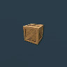      |      map\_act\_theft\_pickup      |
|                   |          map\_blip\_bike          |
|                  |          map\_blip\_brute         |
|                   |          map\_blip\_heli          |
|                  |          map\_blip\_plane         |
|       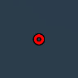      |       map\_blip\_specialist       |
|                   |          map\_blip\_tank          |
|                    |           map\_blip\_ufo          |
|          |      map\_crosshair\_disabled     |
|                    |           map\_lod\_crib          |
|            |      map\_other\_blip\_human      |
|           |      map\_other\_blip\_revive     |
|      |   map\_other\_blip\_revive\_glow  |
|          |     map\_other\_blip\_vehicle     |
|          |     map\_other\_bookmark\_a\_1    |
|          |     map\_other\_bookmark\_a\_2    |
|          |     map\_other\_bookmark\_a\_3    |
|          |     map\_other\_bookmark\_a\_4    |
|          |     map\_other\_bookmark\_a\_5    |
|          |     map\_other\_bookmark\_b\_1    |
|          |     map\_other\_bookmark\_b\_2    |
|          |     map\_other\_bookmark\_b\_3    |
|          |     map\_other\_bookmark\_b\_4    |
|          |     map\_other\_bookmark\_b\_5    |
|     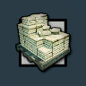     |     map\_other\_collect\_drug     |
|         |     map\_other\_collect\_money    |
|       |    map\_other\_collect\_photoop   |
|       |    map\_other\_collect\_sexdoll   |
|                  |          map\_other\_crib         |
|            |      map\_other\_crib\_4sale      |
|            |      map\_other\_hidden\_act      |
|        |    map\_other\_hidden\_mission    |
|       |    map\_other\_hidden\_property   |
|          |     map\_other\_hidden\_store     |
|                |         map\_other\_radius        |
|              |        map\_other\_waypoint       |
|              |        map\_start\_chopshop       |
|     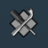    |     map\_start\_chopshop\_grey    |
|    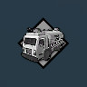   |    map\_start\_cleansweep\_grey   |
|           |     map\_start\_dlc\_gk\_ball     |
|      |  map\_start\_dlc\_gk\_ball\_grey  |
|         |    map\_start\_dlc\_gk\_escort    |
|    | map\_start\_dlc\_gk\_escort\_grey |
|            |      map\_start\_dlc\_gk\_fly     |
|       |   map\_start\_dlc\_gk\_fly\_grey  |
|            |      map\_start\_dlc\_gk\_run     |
|       |   map\_start\_dlc\_gk\_run\_grey  |
|       |    map\_start\_drugtrafficking    |
|  | map\_start\_drugtrafficking\_grey |
|                |         map\_start\_escort        |
|           |      map\_start\_escort\_grey     |
|      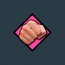      |       map\_start\_flashpoint      |
|         |     map\_start\_guardianangel     |
|    |  map\_start\_guardianangel\_grey  |
|      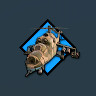     |      map\_start\_heliassault      |
|   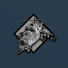   |   map\_start\_heliassault\_grey   |
|            |       map\_start\_humantorch      |
|    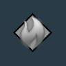   |    map\_start\_humantorch\_grey   |
|              |        map\_start\_insfraud       |
|     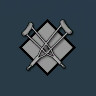    |     map\_start\_insfraud\_grey    |
|        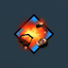        |         map\_start\_mayhem        |
|      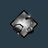     |      map\_start\_mayhem\_grey     |
|            |       map\_start\_runningman      |
|       |    map\_start\_runningman\_grey   |
|                |         map\_start\_snatch        |
|           |      map\_start\_snatch\_grey     |
|      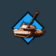      |       map\_start\_tankmayhem      |
|    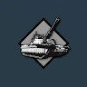   |    map\_start\_tankmayhem\_grey   |
|              |        map\_store\_clothing       |
|        |    map\_store\_clothing\_4sale    |
|                   |          map\_store\_gun          |
|             |       map\_store\_gun\_4sale      |
|              |        map\_store\_mechanic       |
|        |    map\_store\_mechanic\_4sale    |
|              |        map\_store\_property       |
|        |    map\_store\_property\_4sale    |
|               |        map\_store\_surgeon        |
|         |     map\_store\_surgeon\_4sale    |
|                |         map\_store\_tattoo        |
|          |     map\_store\_tattoo\_4sale     |
