# 🚙 Vehicles

## Cars

| Picture | Vehicle | Model Name |
|:-------:|:-------:|:----------:|
|  | Alaskan | suv_4dr_06 |
|  | Anchor | van_4dr_news01 |
|  | ASP | sp_tank02 |
|  | Atlantica | suv_4dr_Luxury07 |
|  | Attrazione | car_2dr_exoticsports01 |
| 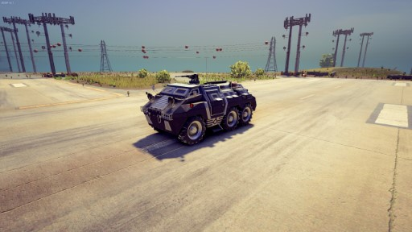 | Bear | sp_apc01 |
| 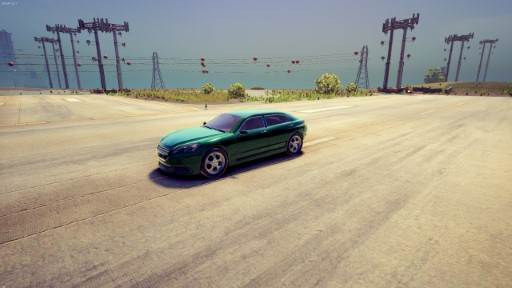 | Blade | car_2dr_exoticsports10 |
|  | Bootlegger | car_2dr_muscle02 |
| 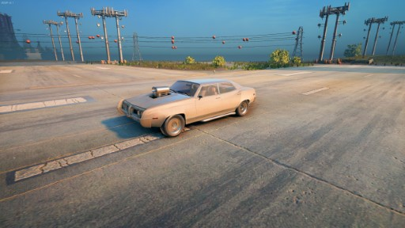 | Bootlegger (Debug) | car_4dr_police02test |
| 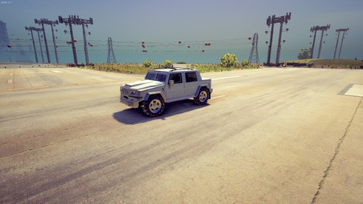 | Bulldog | suv_4dr_luxury05 |
|  | Bulldog (Military) | suv_4dr_luxury05T |
|  | Challenger | sp_tank01 |
|  | Churchill | car_4dr_standard07 |
|  | Cosmos | car_2dr_standard03 |
|  | Crusader | sp_tank03 |
|  | Crusader 2 | sp_tank03_Reward |
| 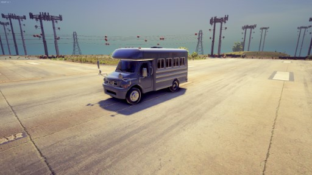 | DonoVan | sp_shortbus01 |
| 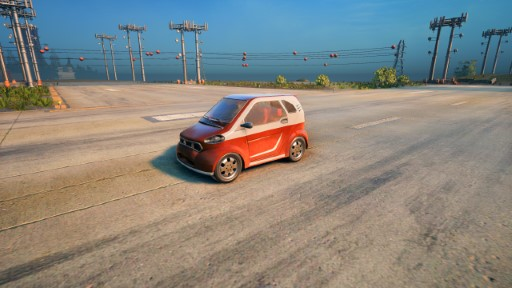 | Emu | car_2dr_compact08 |
| 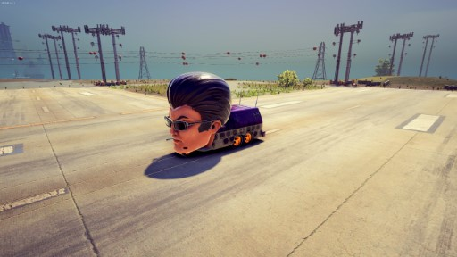 | GAT Mobile | sp_gat01 |
| 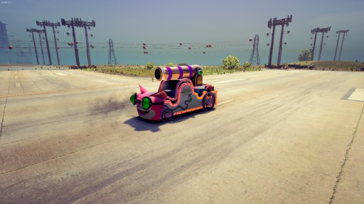 | Genki Cannon | sp_genki_cannon |
|  | Genki Mobile | car_4dr_genki |
|  | Go | car_2dr_standard06 |
|  | Halberd | car_2dr_compact04 |
|  | Hammer | car_4dr_muscle01 |
| 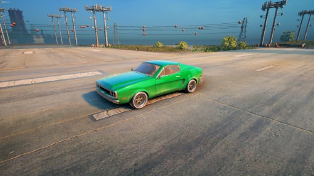 | Hammerhead | car_2dr_muscle01 |
|  | Infuego | car_4dr_luxury06 |
|  | Justice | car_4dr_exoticluxury01 |
|  | Kayak | suv_4dr_07 |
|  | Kayak 2 | suv_4dr_07_yrn |
|  | Keystone | wagon_4dr_sprt01 |
| 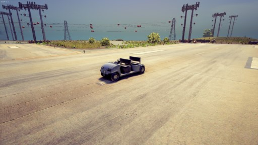 | Knoxville | sp_cart01 |
| 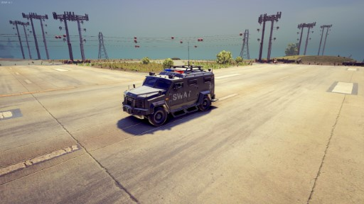 | Lockdown | van_2dr_riot02 |
|  | Nelson | car_2dr_luxury04 |
|  | Neuron | car_4dr_sports03 |
|  | N-Forcer | suv_4dr_02 |
| 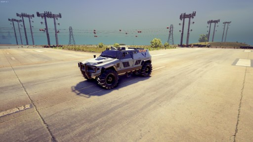 | N-Forcer 2 | suv_4dr_02NT |
|  | Nordberg | suv_4dr_04 |
| 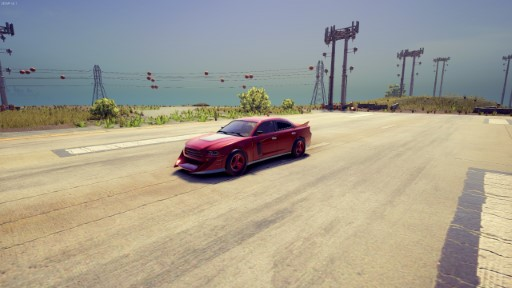 | Nyte Blade | car_4dr_Nyte01 |
| 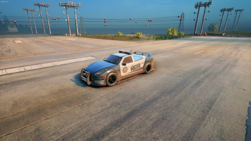 | Peacemaker | car_4dr_police02 |
| 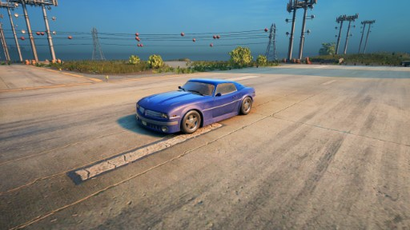 | Phoenix | car_2dr_muscle04 |
|  | Pony Cart | sp_pony_cart01 |
| 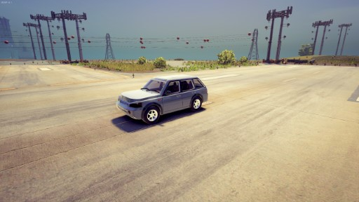 | Quasar | suv_4dr_luxury06 |
| 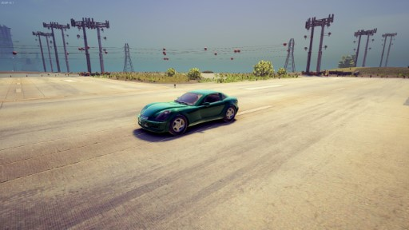 | Raycaster | car_2dr_sports03 |
|  | Reaper | sp_hearse01 |
| 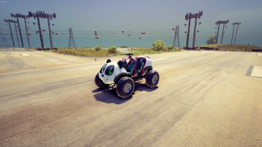 | Sad Panda | sp_rover_genki |
|  | Saints Crusader | sp_tank03_saints |
| 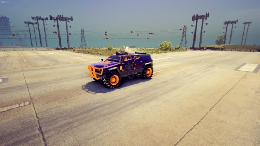 | Saints N-Forcer | suv_4dr_02_saints |
| 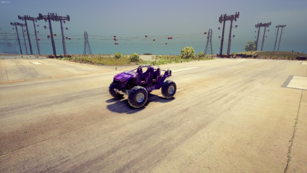 | Saints Raider | sp_rover_01 |
|  | Sexy Kitten | car_2dr_exotic04_genki |
| 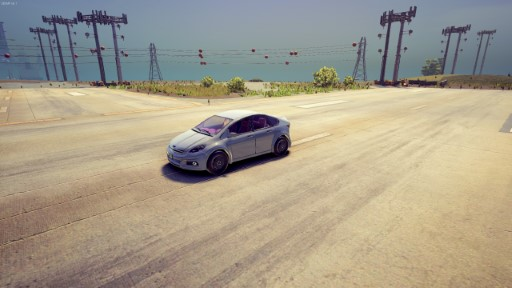 | Solar | car_4dr_compact01 |
|  | Solar 2 | car_4dr_compact01_yrn |
|  | Sovereign | car_2dr_luxury05 |
|  | Status Quo | sp_limo01 |
|  | Taxi | car_4dr_taxi01 |
|  | Temptress | car_2dr_exoticsports09 |
| 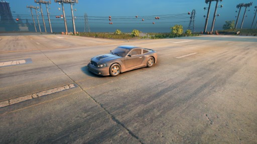 | Torch | car_2dr_sports09 |
| 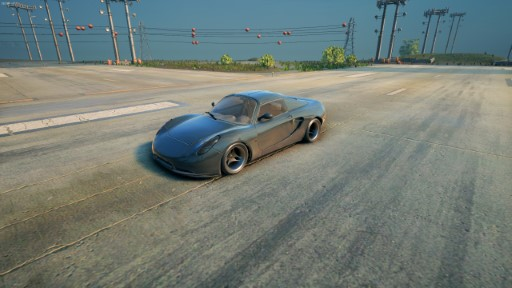 | Vortex | car_2dr_exoticsports04 |
| 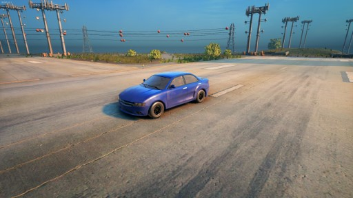 | Wakazashi | car_4dr_sports02 |
|  | Westbury | minivan_4dr_01 |
| 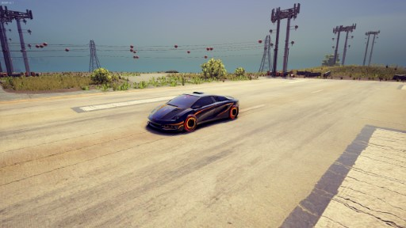 | Wraith | car_2dr_cybersports01 |
|  | Zimos | car_4dr_standard03 |

## Trucks

| Picture | Vehicle | Model Name |
|:-------:|:-------:|:----------:|
|  | Ambulance | sp_ambulance01 |
|  | Blaze | truck_2dr_fire01 |
| 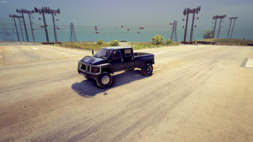 | Compensator | truck_4dr_pickup04 |
| 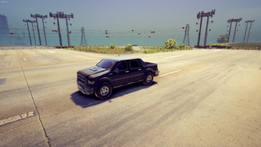 | Criminal | truck_4dr_pickup07 |
| 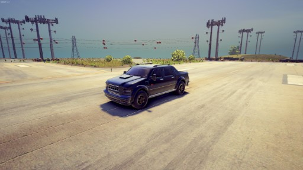 | Criminal 2 | truck_4dr_pickup07_yrn |
|  | Flatbed | truck_2dr_flatbed01 |
| 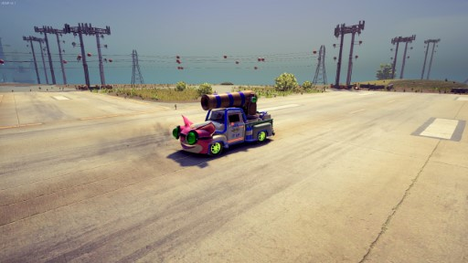 | Genki Manapult | truck_2dr_classic01 |
| 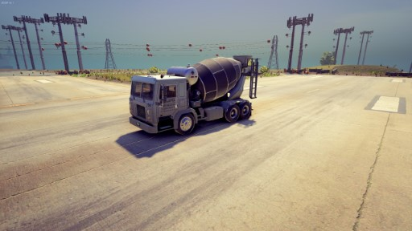 | Mixmaster | truck_2dr_construct01 |
|  | Mule | truck_2dr_mover01 |
|  | Peterliner | truck_2dr_semi01 |
| 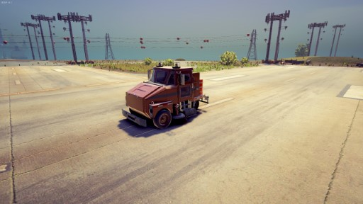 | Scrubber | truck_2dr_cleaner01 |
|  | Steelport Municipal | truck_2dr_garbage01 |
|  | Thorogood | truck_2dr_pickup03 |
|  | Thorogood 2 | truck_2dr_pickup03_dlc |
| 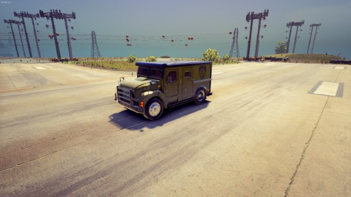 | Titan | truck_2dr_armored01 |
| 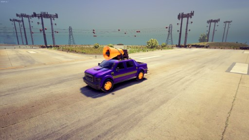 | Torbitron | truck_4dr_pickup07_clns |

## Bikes

| Picture | Vehicle | Model Name |
|:-------:|:-------:|:----------:|
|  | Angry Tiger | bike_exotic01_Genki |
|  | Bloody Canoness | bike_BC01 |
|  | Estrada | bike_standard02 |
|  | Genki Verminator | sp_atv01_Genki |
|  | Kaneda | bike_exotic01 |
| 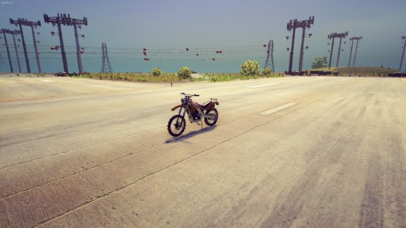 | Sandstorm | bike_dirt01 |
| 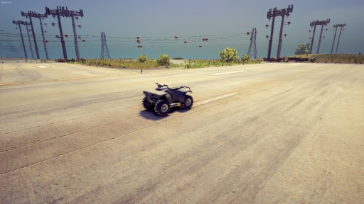 | Verminator | sp_atv01 |
|  | Widowmaker | bike_moped01 |
| 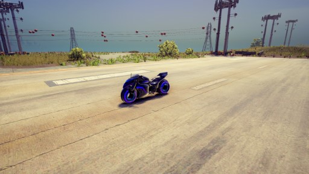 | X-2 Phantom | bike_cyber01 |

## Boats

| Picture | Vehicle | Model Name |
|:-------:|:-------:|:----------:|
|  | Commander | boat_speed04 |
|  | Miami | boat_speed01 |
|  | Shark | boat_wavecraft01 |

## Planes

| Picture | Vehicle | Model Name |
|:-------:|:-------:|:----------:|
|  | AB Destroyer | plane_fighter02 |
| 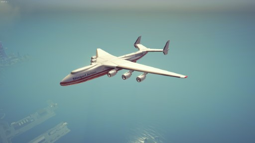 | Gawalek A36 | plane_giant01 |
|  | Snipes 57 | plane_jet01 |
|  | Snipes 57 (Glitched) | plane_jet01_car_rig |
|  | STAG Giant Plane | plane_giant02 |
| 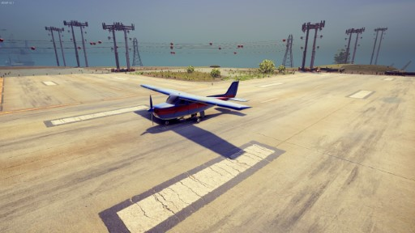 | Woodpecker | plane_standard01 |

## Helicopters

| Picture | Vehicle | Model Name |
|:-------:|:-------:|:----------:|
| 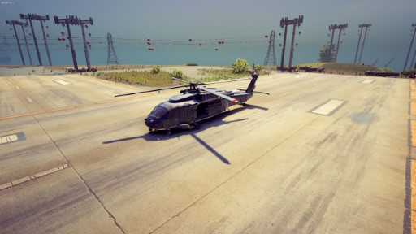 | Eagle | heli_fighter_03 |
| 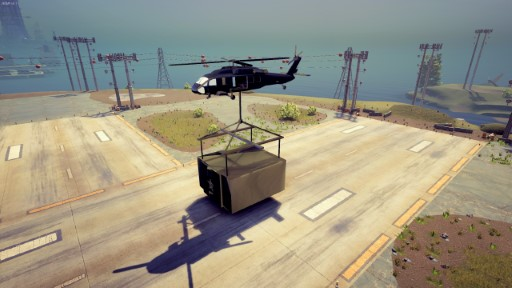 | Eagle (Glitched) | heli_fighter_03_mad |
|  | Heist Heli (Glitched) | heli_standard_04_heist |
|  | MS05 | heli_fighter_03_MS05 |
| 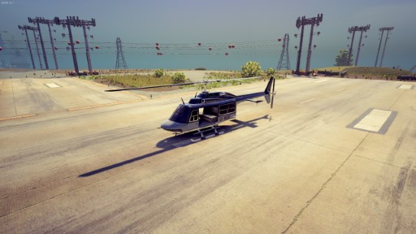 | Oppressor | heli_4dr_police01 |
| 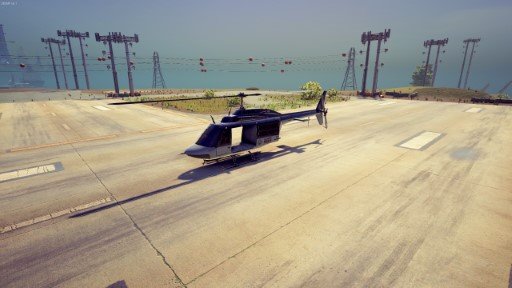 | Oppressor 2 | heli_4dr_police02 |
|  | Oppressor 3 | heli_4dr_police_DLC |
| 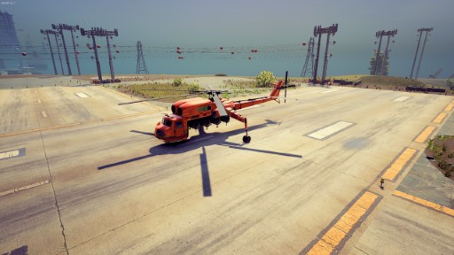 | Stork | heli_standard_04 |
| 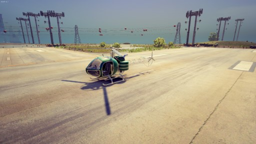 | Thompson | heli_standard_02 |
| 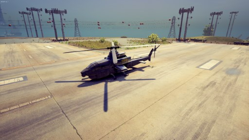 | Tornado | heli_fighter_01 |
| 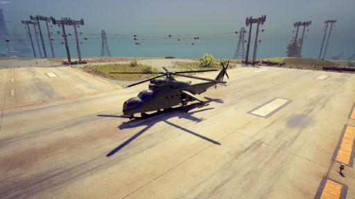 | Vulture | heli_fighter_02 |

## VTOLs

| Picture | Vehicle | Model Name |
|:-------:|:-------:|:----------:|
|  | Aegean | sp_ufo02 |
|  | Aegean (Cutscene) | sp_ufo02_cs |
|  | Condor | sp_vtol02 |
|  | F-69 Stag | sp_vtol01 |
| 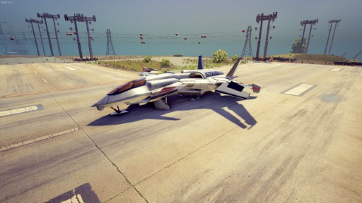 | F-69 Stag (Cutscene) | sp_vtol01_cs |
| 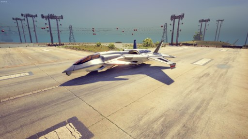 | F-69 Stag (FlyBy) | sp_vtol01_flyby |
|  | Interceptor | bike_jet02 |
| 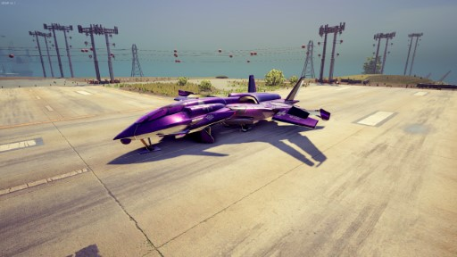 | Saints VTOL | sp_vtol01_saints |
| 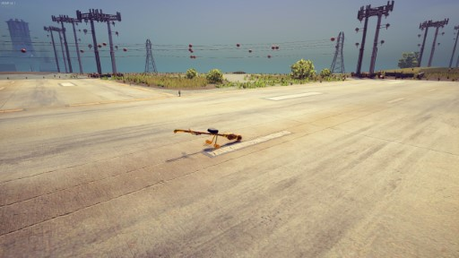 | Salem | bike_broomstick01 |
|  | Scythe | bike_jet03 |
|  | Specter | bike_jet01 |

## Others

| Picture | Vehicle | Model Name |
|:-------:|:-------:|:----------:|
|  | Sphere (Glitched) | sp_mdsphere |
|  | Yarnie | sp_mdsphere_genki |
