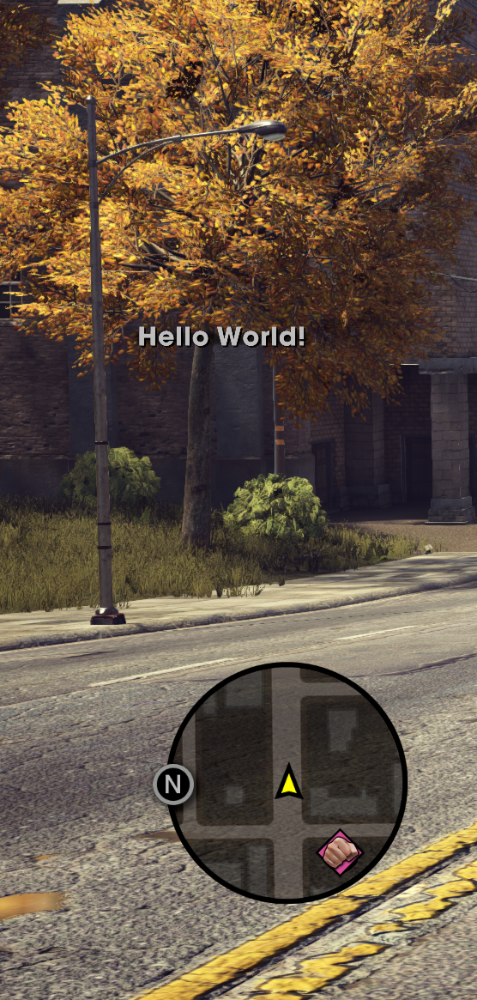

# 0.1.0

* Fixed fibers creation/deletion was not thread safe (Loading into a server, disconnecting could cause rare crashes)
* Fixed a memory leak related with discord RPC, due to the RPC being inited multiple times.
* Added console command `show_fps`, usage `show_fps 1` or `show_fps 0`. (FPS counter is now disabled by default)
* Added Render Settings to F3 debug menu. (So you can mess around and tweak some render settings)
* Added Resources Monitoring on F6 key.
* ImGUI windows (F3, F6 & F8 menus) can now be unfocused by clicking in an empty space on screen, leaving the window open and giving back player controls.
* Added Client HTTP to download server LUA resources.
* Added LUA scripting support. (Client scripts only yet)
* Now when joining a server your game download custom LUA scripts from the server.
* Hide HUD script is no longer hardcoded inside client dlls. Moved to server LUA resources.
* No Clip script is no longer hardcoded inside client dlls. Moved to server LUA resources.
* Welcome message is no longer hardcoded on the server. Moved to server LUA resources.
* Zones swap (Map placements like Daedalus as an example) are no longer hardcoded inside client dlls. Moved to server LUA resources.
* Added LUA function `event.register`
* Added LUA function `event.add_handler`
* Added LUA function `event.call`
* Added LUA function `event.wait`
* Added LUA function `hud.hide`
* Added LUA function `hud.message_add`
* Added LUA function `hud.tutorial_start`
* Added LUA function `hud.tutorial_end`
* Added LUA function `human.enable_gravity`
* Added LUA function `human.enable_collision`
* Added LUA function `human.set_invulnerable`
* Added LUA function `human.set_never_ragdoll`
* Added LUA function `input.key_down`
* Added LUA function `input.key_just_pressed`
* Added LUA function `input.key_just_released`
* Added LUA function `input.key_disable`
* Added LUA function `input.key_enable`
* Added LUA function `input.controller_is_connected`
* Added LUA function \`input.joy\_get\_value
* Added LUA function `input.button_get_value`
* Added LUA function `input.button_is_pressed`
* Added LUA function `input.button_just_pressed`
* Added LUA function `object.get_position`
* Added LUA function `object.set_position`
* Added LUA function `object.get_forward_vector`
* Added LUA function \`player.get\_local
* Added LUA function `player.lock_actions`
* Added LUA function `ui.pause_menu_is_open`
* Added LUA function `render_settings.override`
* Added LUA function `render_settings.reset`

<figure><figcaption>
Resources Monitoring
</figcaption></figure>
